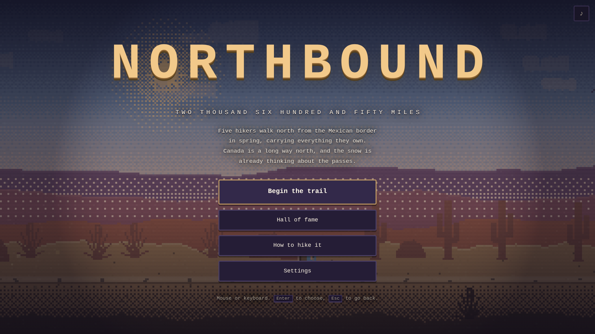
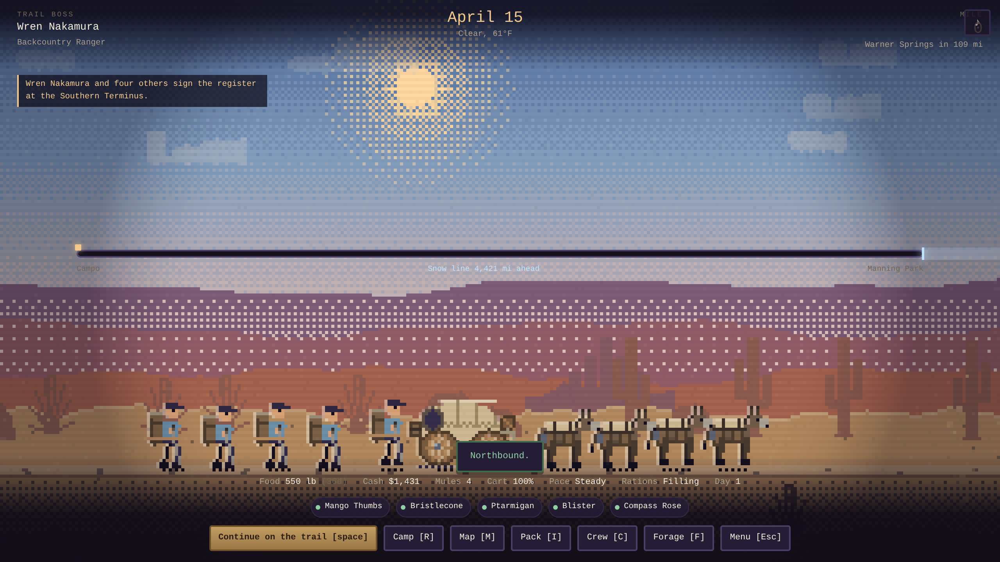
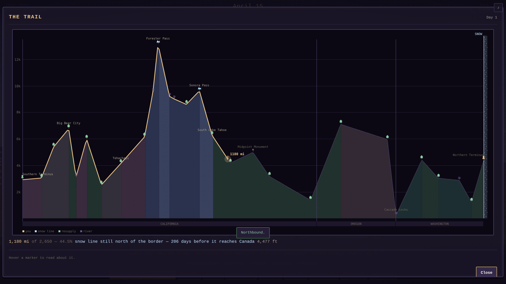

<div align="center">

# N O R T H B O U N D

### *The Oregon Trail, walked instead of driven*

**Five hikers. Everything they own on their backs. 2,650 miles to Canada, and the snow is already thinking about the passes.**

[](#-running-it)
[](#-desktop)
[](#-the-art-is-generated)
[](#-the-music-is-synthesized)
[](#-architecture)



*A deliberate clone of* The Oregon Trail *— occupations, outfitting, pace and rations, landmarks, river fords,
hunting, dysentery, tombstones and a final score — reskinned into this repo's world: thru-hiking the Pacific Crest Trail.*

</div>

---

## 📖 What this is

This repository already holds two versions of **Thru**, a game about thru-hiking the PCT: the original
C#/MonoGame build in [`/Thru`](../Thru), and a Node/Electron web port in [`/web`](../web).

**Northbound** is a third game that takes the world of those two — the trail, the gear, the weather, the
snow line closing in behind you — and rebuilds it as a **faithful Oregon Trail clone**. Not Oregon Trail's
*look*: its *shape*. If you have played the 1990 version you already know how to play this one.

| The Oregon Trail | Northbound |
|---|---|
| Pick a banker / carpenter / farmer | Pick a trail angel, gear rep, ranger, camp cook or dirtbag |
| Buy oxen, food, spare parts at Matt's | Buy food, layers and spares at the Southern Terminus outfitter |
| Wagon axle / wheel / tongue breaks | Shoes, poles, filter, pack and shelter break |
| More oxen pull the wagon faster | A lighter pack walks faster — pack weight is the whole trade |
| Steady, strenuous, grueling pace | Same three, and grueling is still a trap |
| Filling / meager / bare-bones rations | Same three, still 3 / 2 / 1 lb per person per day |
| Ford, caulk, ferry or wait at the river | Wade, rock-hop, pack-raft, pay a shuttle, or camp and cross at dawn |
| Hunt buffalo, carry 100 lb back | Forage berries, mushrooms and fish, carry 100 lb back |
| Hunting needs bullets you buy at a fort | Foraging needs stove fuel you buy at a store — and leftovers score |
| Menu: continue / supplies / map / pace / rations / rest / trade / talk / buy | The same nine, in the same order |
| Dysentery, measles, typhoid | Giardia, norovirus, hypothermia, stress fracture, snakebite |
| Reach Oregon before winter | Reach Manning Park before the snow line catches you |
| Leave in March vs July | Leave in March vs June — and the Sierra snowpack is the price of leaving early |
| Tombstones with epitaphs | Cairns with epitaphs |
| Points × occupation multiplier | Points × occupation multiplier |

---

## ▶️ Running it

```bash
cd northbound
npm install --omit=dev      # express is the only runtime dependency
npm start                   # → http://localhost:3100
```

No build step, no bundler, no asset download. The sprite atlas is committed; if you want to
rebuild it from source, `npm run bake` regenerates every PNG from code.

```bash
npm test          # node --test — engine invariants and balance
npm run playtest  # headless Chromium plays a full run and fails on any console error
npm run bake      # regenerate the sprite atlases
npm run electron  # desktop window
```

---

## 🎮 The loop

Press **`Continue on the trail`** and days start ticking by. Each day the simulation runs the same
thirteen steps, in the same order, every time:

```
  ☀  ONE DAY ON TRAIL
  │
  ├─  1. The calendar turns over
  ├─  2. Weather rolls or decays          clear · hot · rain · storm · hail · snow · smoke · fog · wind
  ├─  3. Miles = pace × terrain × pack weight × health × weather × gear condition
  ├─  4. Everybody eats                   3 / 2 / 1 lb each, by ration setting
  ├─  5. Health ticks                     pace, rations, cold, altitude, illness, overloading
  ├─  6. Ailments progress                onset · worsen · recover · die
  ├─  7. Spirit drifts                    landmarks lift it, grueling days and funerals sink it
  ├─  8. The kit wears                    a bad roll snaps something; a spare costs nothing, no spare costs days
  ├─  9. THE SNOW LINE ADVANCES           south, faster every week after Labor Day
  ├─ 10. Arrival?                         a landmark stops the day and opens its menu
  ├─ 11. Event?                           ~28% — marmots, wildfire closures, trail magic, a lost resupply box
  ├─ 12. Deaths are recorded              name, cause, mile, epitaph
  └─ 13. Win at mile 2,650. Lose if the snow line reaches you, or nobody is left walking.
```

Everything else — the store, the map, the pack, the crew screen, foraging, fords — hangs off that tick.

### The two calendars

The snow line chases you from the north, and it always closes the northern terminus on the
same date. So leaving early buys weeks of slack. What it costs is the other calendar: the
**Sierra snowpack**, which is still sitting on the high country until mid-June. Arrive
before it melts out and the passes are postholing, whiteouts and creeks at peak melt.

That makes the departure month a real decision instead of a ladder. `scripts/balance.mjs`
plays the real simulation a few hundred times per row and prints this:

| Departure | Win rate | Usually lost to |
|---|---|---|
| March | **80%** | the Sierra buries you |
| April | **93%** | mixed |
| May | **43%** | the snow line catches you |
| June | **0%** | snowed off, always |

Grueling being *worse* than strenuous is deliberate, and it is asserted by a test. So is the
shape of that table: the harness exits non-zero if the best month climbs above 96%, if the
spread between the best and worst month narrows below 40 points, or if a reckless crew starts
finishing more than a third of the time.

### The trail owes you a quiet stretch

Events roll once a day, but they cannot fire inside the days owed by the last
interruption — and a town, a river, a rest day and a card all count. Without that floor
a per-day roll bunches, and the trail becomes walk-two-days-read-a-card until neither
the walking nor the cards land. With it, something stops you every four days or so, and
the stretch in between is long enough to watch the country change. Two tests pin it: one
that no event lands inside the quiet stretch, one that the overall cadence stays between
two and a half and seven days.

### Weight is the whole trade

There are no oxen on the Pacific Crest Trail, and there is no wagon. Everything the crew owns
rides on somebody's back, so the lever The Oregon Trail puts on livestock sits here on **pack
weight**. Capacity is 12 lb plus 34 lb for every hiker still walking — 182 lb for a full crew
of five, and it *shrinks when somebody dies*, which is the cruellest arithmetic in the game.

Under about half of capacity the crew moves better than baseline. Past capacity the hip belts
are cinched to nothing and the miles show it. Since food is a pound a day per person, the
carry is the entire planning problem: buy five or six days and resupply in town, or haul two
weeks up a climb and walk it at a crawl. Between Kennedy Meadows and Tuolumne there are 240
miles and no store, and no pack in the game is big enough for that — which is what foraging
is for.



---

## 🗺️ The trail

Twenty-eight real PCT landmarks from Campo to Manning Park, with their real mileages and elevations:
Mount Laguna, Deep Creek, Cajon Pass, Hikertown, Kennedy Meadows, Forester Pass, Muir Trail Ranch,
Sonora Pass, Sierra City, the Midpoint Monument, Burney Falls, Seiad Valley, Crater Lake,
Timberline Lodge, Cascade Locks, Snoqualmie, Stehekin, and the monument on the border.

Nineteen of them will sell you food. Six of them are river crossings that can take a pack off your back.



---

## 🎨 The art is generated

Every pixel in this game was drawn **by code, into PNG files, by a script in this repo**.
`scripts/bake-assets.mjs` has no dependencies — it encodes PNGs by hand with Node's `zlib` — and
emits the sprite atlas plus `atlas.json`:

- six-frame walk cycles for the crew, the leader, and a packer's mule string that passes going south
- landmark silhouettes, biome props, weather sprites, item icons, a 5×7 bitmap font, a nine-slice UI frame
- forage and ford minigame sprites

The scene itself is composed live: dithered sky bands, parallax ridgelines seeded by your mile so the
world is stable, drifting clouds, per-biome palettes that crossfade as you walk north, weather overlays,
lightning, campfire light at night, and a grain pass over the whole 320×180 buffer.

---

## 🎵 The music is synthesized

There are no audio files either. `public/js/audio/` is a small WebAudio synthesizer — oscillators,
envelopes, filters, a procedurally generated reverb impulse — plus a look-ahead sequencer and fourteen
compositions written for it: a title theme, four biome themes, town, store, night camp, danger,
the ford, the forage, a funeral, a victory and a defeat. They share motifs so the score hangs together.

---

## 🏗️ Architecture

```
northbound/
├── server.js              express: static host + save/score API
├── data/                  shared ES modules — imported by the browser AND by node --test
│   ├── trail.js           28 landmarks, elevation interpolation, terrain factors
│   ├── items.js           the catalog and price model
│   ├── events.js          the random event deck
│   ├── ailments.js        illness and injury definitions
│   ├── party.js           occupations, names, trail names, epitaphs
│   ├── dialogue.js        what people say at landmarks
│   └── store.js           what each store stocks
├── public/js/
│   ├── engine/            pure simulation — no DOM, seeded RNG, deterministic
│   ├── render/            atlas, scene, particles, map, bitmap text
│   ├── audio/             synth + sequencer + the score
│   ├── minigames/         foraging and river fords
│   └── ui/                screen router, HUD, and one module per screen
├── scripts/
│   ├── bake-assets.mjs    generates every sprite
│   ├── playtest.mjs       headless full playthrough
│   └── shots.mjs          visual QA: the scene across every biome/time/weather
└── test/                  node --test
```

The engine never imports the renderer, the renderer never imports the UI, and the data layer imports
nothing. That is why the same simulation can be unit-tested in Node and driven by a canvas in Chromium.

---

## 🧪 Verification

`npm test` runs 120 assertions over the data tables, the simulation, the DOM helper and
**Oregon Trail parity** — `test/oregon-trail-parity.test.js` pins the three-by-three
pace/ration grid at 3/2/1 lb a head, the money-versus-score tradeoff on the occupation,
foraging being gated behind a purchasable consumable, the five river-crossing options,
and what the final tally counts.

`npm run playtest` boots the real server, opens the real game in Chromium, sets up a crew, outfits them,
and plays until the run ends — clicking through landmarks, buying food when it runs low, crossing rivers,
foraging, and resolving events — while failing the build on **any** console error, page error or failed
request. The screenshots in this README are its output.

`node scripts/shots.mjs` renders the scene across all seven biomes × four times of day × the weather
set, plus a labelled contact sheet of every sprite in the atlas, so the art can be reviewed by eye.
That pass is what caught the flat ridgelines: the terrain hash relied on 32-bit multiply overflow,
which JavaScript does not give you, so the value noise had been returning a constant.

---

<div align="center">

*Built on the shoulders of [`/Thru`](../Thru) and [`/web`](../web).*
*Real mileages, real landmarks, invented weather.*

</div>
