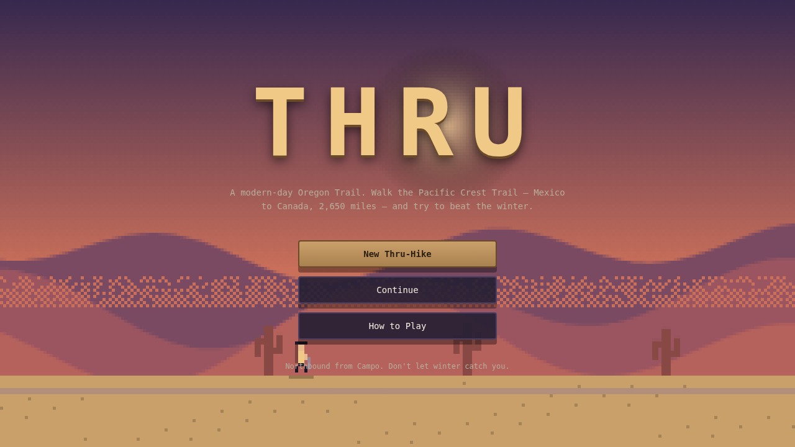
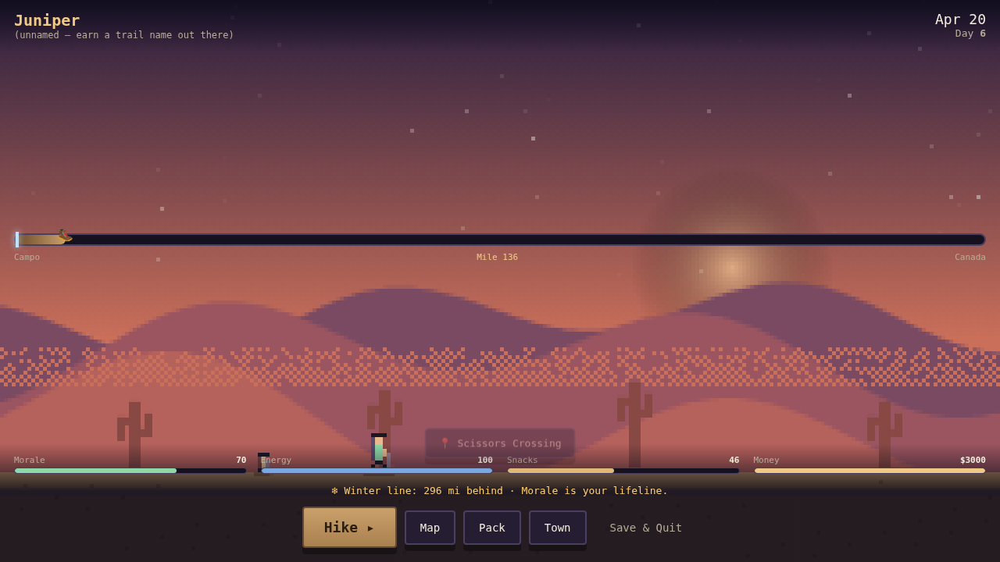
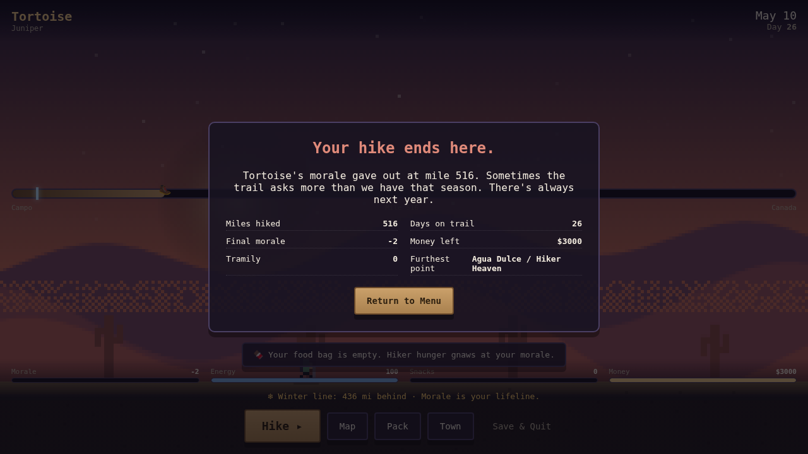
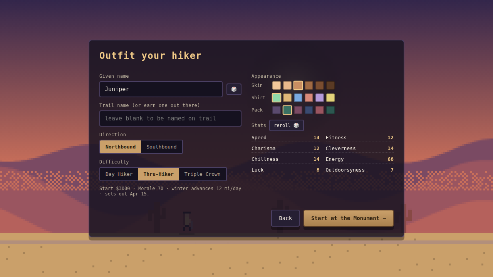
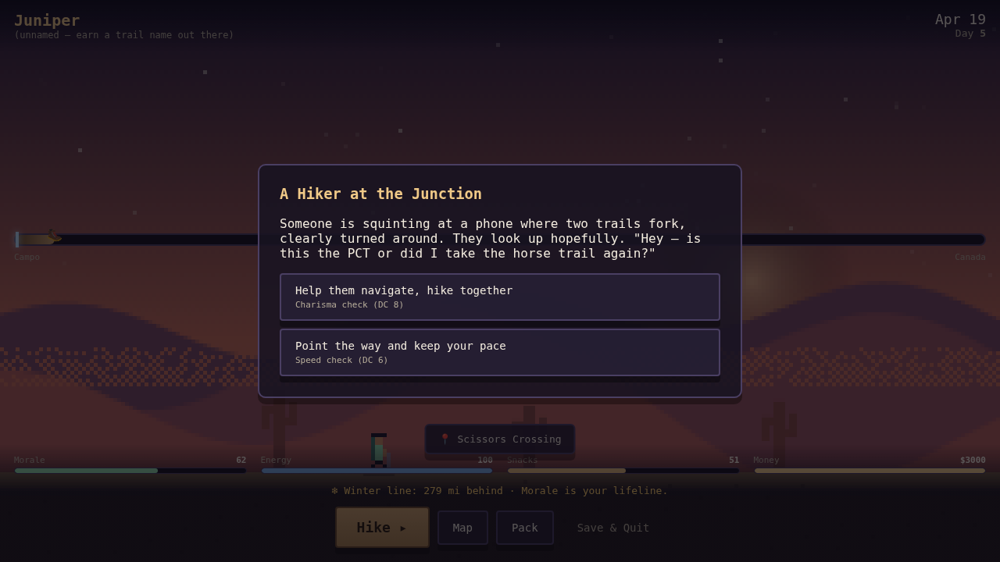
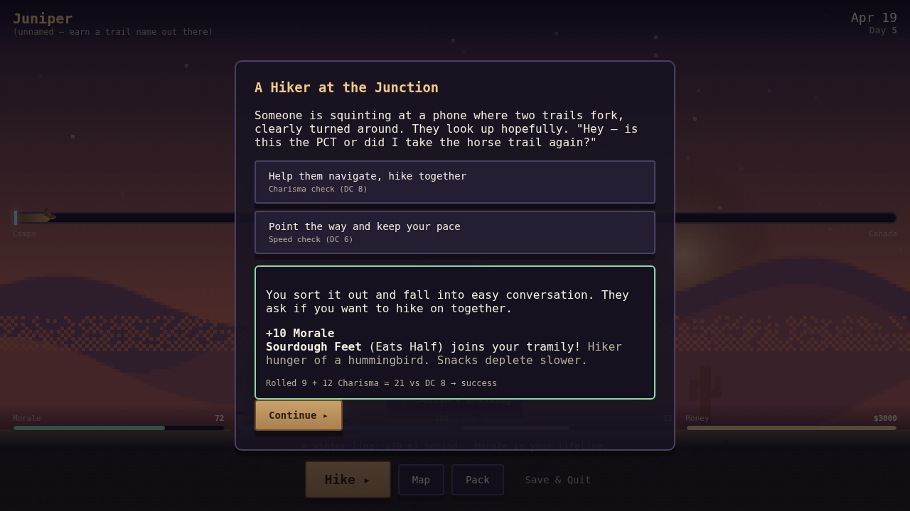
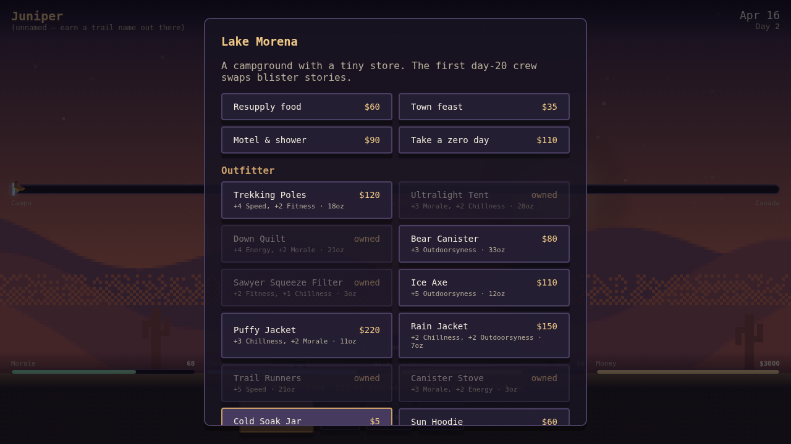
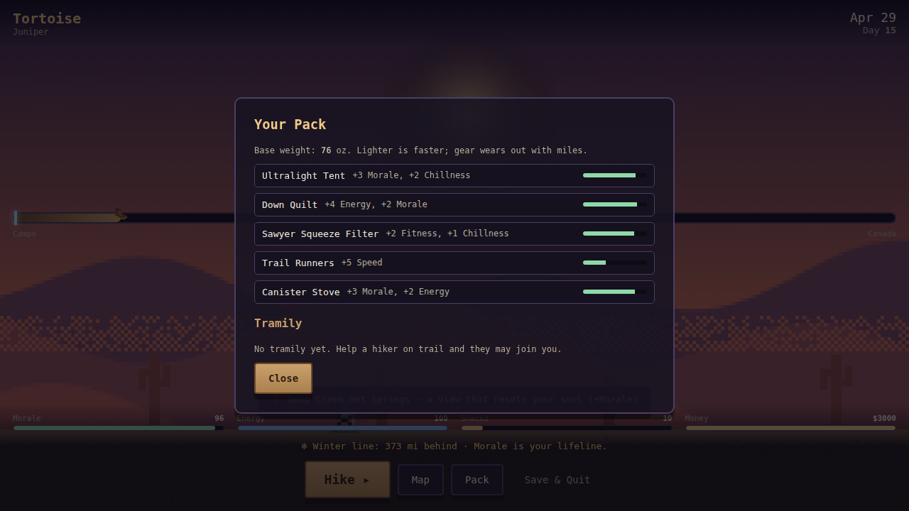
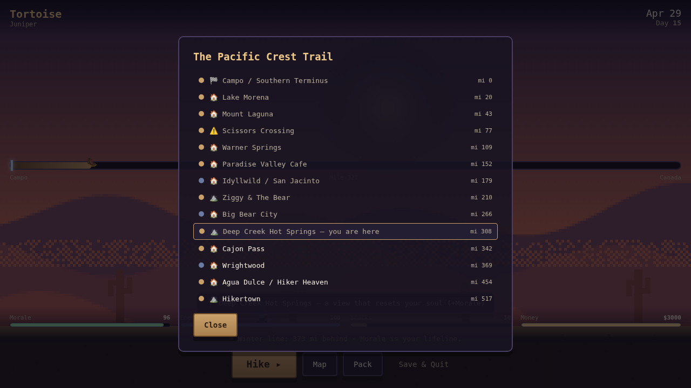

<div align="center">

# 🥾 T H R U

### *A modern-day Oregon Trail on the Pacific Crest Trail*

**Walk 2,650 miles from Mexico to Canada. Outrun the winter. Don't lose heart.**

[](#-running-it)
[](#-desktop--steam)
[](#-the-look)
[](#-testing--verification)
[](#-the-look)



*A web port of the in-development Unity/MonoGame game [**Thru**](https://store.steampowered.com/app/1730830/Thru/) —*
*rebuilt to run entirely on Node, Electron-ready for Steam, and playable right now with zero external art.*

</div>

---

## 📖 What is this?

**Thru** is a single-player survival/journey game about [**thru-hiking**](https://en.wikipedia.org/wiki/Thru-hiking) the
**Pacific Crest Trail** — the 2,650-mile footpath that runs the spine of the West Coast from the Mexican border to Canada.
It's *Oregon Trail* reimagined for the ultralight-backpacking generation: instead of dysentery and river fords in a wagon,
you face blisters, bear canisters, afternoon thunderstorms, trail magic, and the slow grind of putting one foot in front
of the other, all the way to Monument 78.

There's a twist that defines everything: **there is no health bar. There is only morale.** You don't die out here — you
*get off trail*. And the whole time, an invisible **winter line** is creeping up the trail behind you, closing the high
passes with snow. Hike too slow, lose heart, or run out of money in the wrong town, and the season ends your hike for you.

> This repository's `/Thru` folder is the original C#/MonoGame source. This `/web` port is a faithful, self-contained
> reimplementation of its mechanics — the stat model, the `stat + d20` encounter checks, the gear/wear system, the
> tramily relationships, and **real PCT waypoint data** are all drawn straight from it.

---

## ▶️ Running it

```bash
cd web
npm install --omit=dev      # the only runtime dependency is express
npm start                   # → open http://localhost:3000
```

That's the whole setup. No build step, no bundler, no asset download — the game draws all of its pixel art procedurally.

---

## 🎮 The gameplay loop



Every press of **`Hike ▸`** advances **one day on trail**. In that day the simulation:

```
   ☀  ADVANCE A DAY
   │
   ├─ 1. Roll daily mileage   = f(Speed, Energy, Morale, terrain, pack weight, tramily)
   ├─ 2. Move up the trail    → toward Canada (NOBO) or Mexico (SOBO)
   ├─ 3. Wear your gear       → every item loses durability equal to miles hiked
   ├─ 4. Eat                  → Snacks drain; empty food bag = morale punishment
   ├─ 5. Sleep                → Energy restores (a good quilt & tent restore more)
   ├─ 6. Morale drifts        → hard terrain wears you down; scenery & tramily lift you
   ├─ 7. The calendar ticks   → and the WINTER LINE advances toward you
   ├─ 8. Milestones fire      → reach a town? a landmark? a hazard?
   └─ 9. Roll an encounter    → ~50% chance of a trail event for the current biome
```

You read the situation off the HUD — the **progress rail** (your 🥾 vs. the glowing winter marker), the **live stat
bars**, and a **winter-distance warning** that turns red when the snow is closing in — and decide your next move:
keep hiking, duck into a **Town**, check the **Map**, or audit your **Pack**.

### 🏁 How it ends

| Outcome | Trigger |
|---|---|
| 🏆 **You thru-hike** | Reach the far terminus (Canada for NOBO, Mexico for SOBO). |
| 💔 **You lose heart** | **Morale drops below 0** — the hiker leaves trail. |
| ❄️ **Winter catches you** | The winter line reaches your mile — the passes close, you're off trail. |

<div align="center">

</div>

---

## 🧬 The stats

Your hiker is defined by **eight core stats** that gate encounter checks, plus four **meta stats** that track survival.
Stats are rolled at character creation (and modified by gear & tramily).

| 🎲 Core stat | What it does |
|---|---|
| **Speed** | The single biggest driver of daily mileage. |
| **Fitness** | Hardiness — restores more Energy each night; powers "tough it out" checks. |
| **Charisma** | Talking your way through people-encounters; recruiting tramily. |
| **Cleverness** | Route-finding, problem-solving, reading a map or a sky. |
| **Chillness** | Staying calm — patience checks, waiting out storms, not panicking. |
| **Energy** | Spent hiking, restored by sleep. Low energy = slow miles. |
| **Luck** | The wild card baked into hiker-box dives and gambles. |
| **Outdoorsyness** | Backcountry competence — fords, snow, water management. |

| ❤️ Meta stat | What it does |
|---|---|
| **Morale** | **Your lifeline.** Below 0 and your hike is over. Towns, scenery & trail magic refill it. |
| **Money** | Finite, set by difficulty. Spent in towns on food, morale, gear & zeros. |
| **Snacks** | Your food bag. Hits empty and morale plummets (hiker hunger). |
| **Miles** | Total distance walked — your progress toward the monument. |

---

## 🧗 Character creation



Before you set out from the monument you choose:

- **Name** (or roll one) — and optionally a **trail name**. Leave it blank and the trail will *give* you one. You don't
  pick your trail name out here; it picks you.
- **Direction** — **Northbound** from Campo (the classic) or **Southbound** from Canada.
- **Difficulty** — which sets your starting money, morale, *and* how fast winter chases you:

| Difficulty | Start money | Start morale | Winter speed | Sets out |
|---|---:|---:|---:|---|
| 🟢 **Day Hiker** | $4,500 | 80 | 9 mi/day | Mar 20 |
| 🟡 **Thru-Hiker** | $3,000 | 70 | 12 mi/day | Apr 15 |
| 🔴 **Triple Crown** | $1,800 | 60 | 15 mi/day | May 1 |

- **Appearance** — skin, shirt & pack colors for your pixel hiker (and the customizer maps 1:1 onto the original game's
  layered spritesheets for when real art drops in).

---

## ⚡ Encounters

<table>
<tr>
<td width="50%"></td>
<td width="50%"></td>
</tr>
</table>

Trail events are **choice cards**, faithful to the original game's resolution model. Each option is a **stat check**:

```
        your stat  +  d20   ≥   the option's DC   →   SUCCESS   else   FAILURE
```

…and the result applies a **stat effect** (and the dice math is shown, so it never feels arbitrary). Some encounters
carry **special outcomes**: recruiting a tramily member, earning a trail name, scoring gear from a hiker box, or a town's
siren-song zero day.

The deck is **biome-aware** — what you meet depends on where you are:

| Biome | A taste of what's out there |
|---|---|
| 🏜️ **Desert** | Rattlesnake on the trail · a dwindling water cache · trail magic coolers |
| 🌲 **Forest** | Mazes of blowdowns · mosquito swarms · wildfire smoke on the wind |
| ⛰️ **Mountain** | Afternoon thunderstorms racing you to the pass · a bear in camp |
| 🏔️ **Alpine** | Roaring snowmelt fords · the view from the pass that resets your soul |
| 🌐 **Anywhere** | A lost hiker at the junction · norovirus · *you earn a trail name* |

---

## 🏠 Towns & resupply



Reaching a trail town opens the **town panel**, where your finite money becomes morale, food, and gear. Every PCT town in
the game is a **real resupply stop** with its own flavor text.

| Town action | Cost | Effect |
|---|---:|---|
| 🥫 **Resupply food** | $60 | Refill the food bag (+Snacks). |
| 🍔 **Town feast** | $35 | +Morale, +Energy. |
| 🚿 **Motel & shower** | $90 | A big morale & energy reset. |
| 🛌 **Take a zero day** | $110 | The biggest restore — but winter keeps advancing while you rest. |

…plus a full **outfitter** to buy or replace worn-out gear. *(A `Knows Everyone` tramily member discounts all of it.)*

---

## 🎒 Gear



Gear grants **passive stat bonuses** — but it **wears with every mile and eventually breaks**, losing its bonus until you
replace it in town. Lighter packs hike faster, so every ounce is a trade-off. You leave Campo with a starter kit (tent,
quilt, filter, trail runners, stove) and build from there.

| Gear | Bonus | Weight | Price | Notes |
|---|---|---:|---:|---|
| Trekking Poles | +4 Speed, +2 Fitness | 18 oz | $120 | Saves the knees on climbs. |
| Ultralight Tent | +3 Morale, +2 Chillness | 28 oz | $350 | Dry nights, better mornings. |
| Down Quilt | +4 Energy, +2 Morale | 21 oz | $300 | Warmer sleep restores more energy. |
| Bear Canister | +3 Outdoorsyness | 33 oz | $80 | Required in the Sierra; near-indestructible. |
| Sawyer Filter | +2 Fitness, +1 Chillness | 3 oz | $40 | No stomach lottery. |
| Ice Axe | +5 Outdoorsyness | 12 oz | $110 | Self-arrest on snowbound passes. |
| Puffy Jacket | +3 Chillness, +2 Morale | 11 oz | $220 | Cozy at camp. |
| Rain Jacket | +2 Chillness, +2 Outdoorsyness | 7 oz | $150 | Washington insurance. |
| Trail Runners | +5 Speed | 21 oz | $140 | **Fast — but wears out quickest.** |
| Canister Stove | +3 Morale, +2 Energy | 3 oz | $50 | Hot dinner is a morale machine. |
| Cold Soak Jar | +2 Speed | 2 oz | $5 | No stove, lighter pack, sadder dinners. |
| Sun Hoodie | +2 Fitness, +2 Chillness | 5 oz | $60 | Beats the desert sun. |

---

## 👥 Tramily

On a thru-hike you fall in with a **"trail family."** Help a hiker through an encounter and they may join you,
each bringing a **passive perk** that quietly bends the whole run:

| Perk | Effect |
|---|---|
| 🩹 **Medic** | Softens Energy losses from hazard encounters. |
| 🐿️ **Eats Half** | Snacks deplete more slowly. |
| 🛋️ **Knows Everyone** | Town stays & gear cost less. |
| 🎭 **Camp Comedian** | Slows daily morale drain. |
| 🏃 **Pace Setter** | A flat daily mileage bonus. |
| 🧭 **Navigator** | Better odds on Cleverness checks. |

---

## 🗺️ The trail



The world is **42 real PCT milestones**, in true mileage order from **Campo (mile 0)** to **Manning Park (mile 2,650)** —
Lake Morena, Mount Laguna, Idyllwild, Kennedy Meadows, Forester Pass, Crater Lake, Bridge of the Gods, Snoqualmie,
Stehekin, the Northern Terminus and many more — each with authentic elevation and flavor, mined from the original repo's
GPS waypoint data. The trail flows through **four biomes**, and the terrain literally changes your pace:

| Biome | Feel | Pace |
|---|---|---|
| 🏜️ Desert | SoCal chaparral, saguaros, water caches | Fast & dry |
| 🌲 Forest | Oregon/NorCal conifers, fog, blowdowns | Easy cruising |
| ⛰️ Mountain | Ridgelines, passes, thunderstorms | Slower climbs |
| 🏔️ Alpine | High Sierra & North Cascades snow & granite | Slowest, hardest |

---

## 🎨 The look

The entire game renders in the spirit of **Superbrothers: Sword & Sworcery EP** — tiny silhouetted pixel humans, flat
atmospheric color fields, tight per-biome palettes, glowing skies, dithered horizon haze, and parallax silhouette
ridgelines that drift as you walk. **It's all drawn procedurally from primitives** to a tiny `256×144` internal buffer
and scaled up nearest-neighbour, which is why the game needs **zero external art** to be fully playable.

Real assets are a **drop-in upgrade**, not a dependency:

- **Backgrounds** → load an `Image` and blit before the procedural props in `art.js`.
- **Characters** → swap `drawHiker()` for the original game's layered spritesheets (body / hair / shirt / pack / poles…).
- **Photo textures** → bake permanent pixel versions *offline* with the included tool (never at runtime):

  ```bash
  npm run pixelate -- --in raw/granite.jpg --out public/assets/tex/granite.png --size 128 --quantize
  ```

  *(downscale → snap to the game palette → nearest-neighbour upscale → commit the crisp result.)*

👉 **[`todo.html`](./todo.html)** is a styled, copy-paste prompt sheet for generating every spritesheet, background,
prop, icon, and music track (built for Gemini), organized to match the original's layer system.

---

## 🏗️ Architecture

```
web/
├── server.js               Express server + file-backed save API (mirrors the original FileIO/IOController)
├── public/
│   ├── index.html          the screen shell (menu, creation, HUD, and all modals)
│   ├── css/style.css       the pixel UI theme
│   └── js/
│       ├── engine.js       ← pure simulation, NO DOM: the rules of the game live here
│       ├── art.js          ← procedural Sword & Sworcery pixel renderer
│       ├── ui.js           ← screens, the render loop, and every interaction flow
│       └── main.js         boot
├── data/                   shared by client AND tests:
│   ├── locations.js          42 real PCT milestones (miles, elevations, biomes)
│   ├── encounters.js         the biome-tagged encounter deck + weighted roller
│   ├── gear.js               the gear catalog
│   └── names.js              name pools, trail-name generator, tramily perks
├── electron/main.js        desktop wrapper: spawns the server, opens a window
├── scripts/
│   ├── pixelate.js         offline texture → pixel-art baker (sharp)
│   ├── smoke.mjs           headless end-to-end playthrough
│   └── capture*.mjs        the scripts that produced these screenshots
├── test/engine.test.js     node --test engine invariants
└── todo.html               art & audio generation prompts
```

**Design principle:** the **engine is pure** (no DOM, no rendering) and seedable, so the rules can be tested headlessly
and a run can be reproduced exactly. The renderer and UI are layered on top; the save system serializes the whole game
state to disk via the server (with a `localStorage` fallback).

---

## 🖥️ Desktop / Steam

```bash
npm install                 # adds electron + electron-builder (downloads a binary)
npm run electron            # run as a native desktop app
npm run dist                # build distributable installers → web/dist/
```

The Electron wrapper boots the bundled Node server and loads it in a frameless, pixel-friendly window — the same game,
packaged for distribution.

---

## ✅ Testing & verification

```bash
npm test                    # node --test — 7 engine invariants (progress, both lose
                            #   conditions, win reachable, encounter resolution,
                            #   save round-trip, town economy)
node scripts/smoke.mjs      # headless browser: creates a hiker, plays ~30 days through
                            #   encounters & towns to an end screen, asserts 0 console errors
```

Both are green. Every screenshot in this README was produced by driving the *actual* game in a headless browser
(`scripts/capture.mjs`) — nothing here is a mockup.

---

## 🧭 Provenance & credits

Built as a web port of the in-development game **Thru** by its original developer
([Steam page](https://store.steampowered.com/app/1730830/Thru/)). Mechanics, the stat model, the gear & wear system, the
`stat + d20` encounter resolution, the layered character system, the tramily relationships, and the real PCT waypoint
data are all carried over from the C#/MonoGame source in this repo's `/Thru` directory. Visual direction follows the
Steam screenshots; design rules follow the Steam description.

<div align="center">

*Hike your own hike. See you at the monument.* 🏔️🥾

</div>
